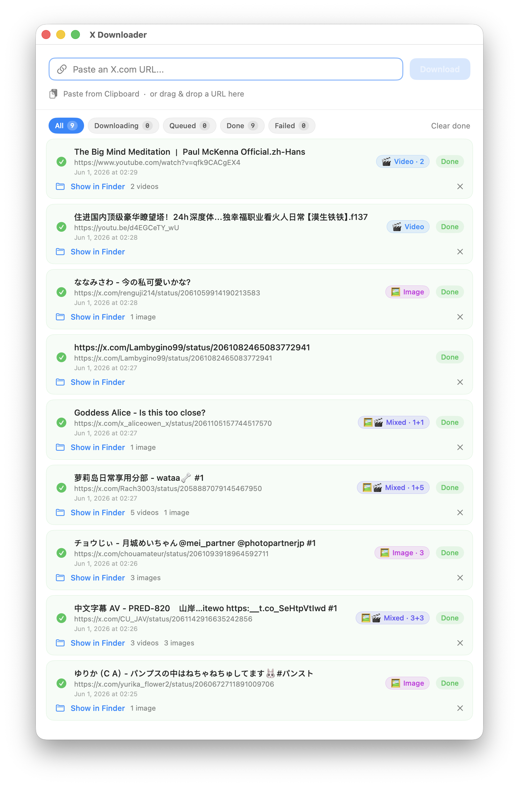
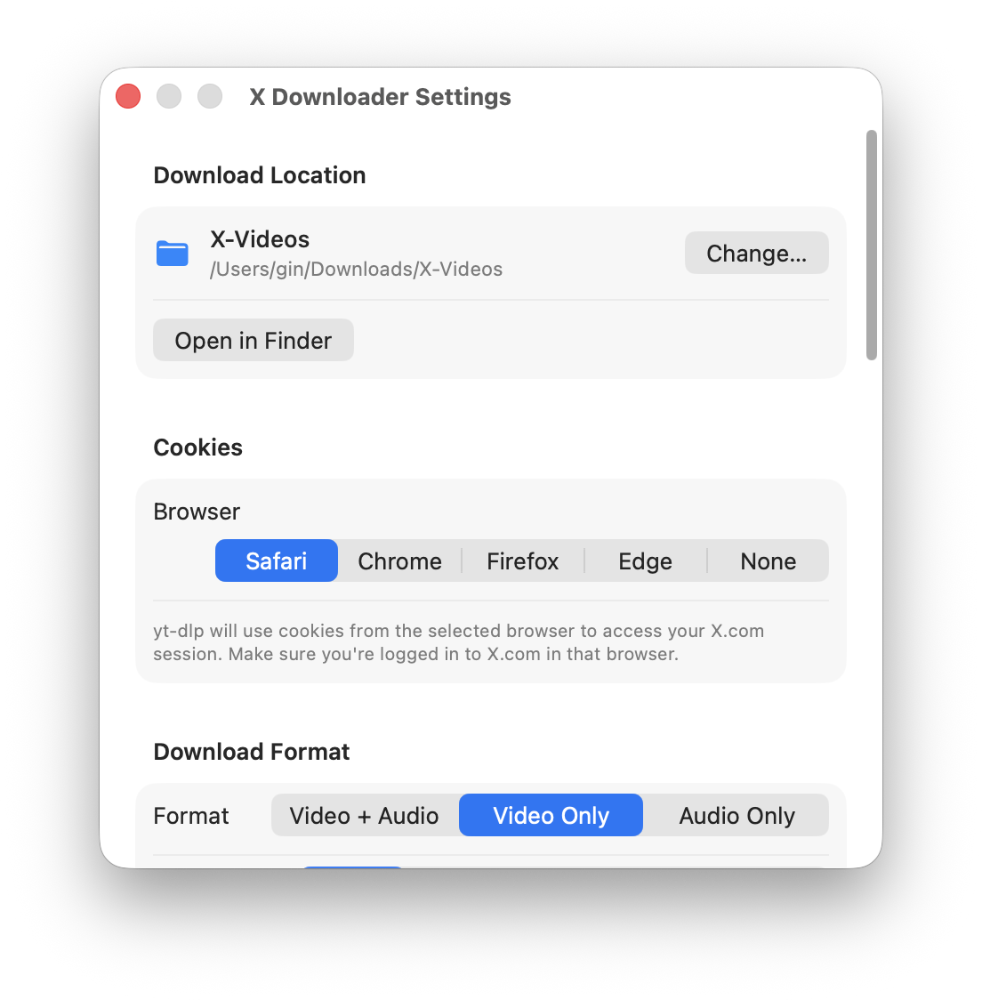
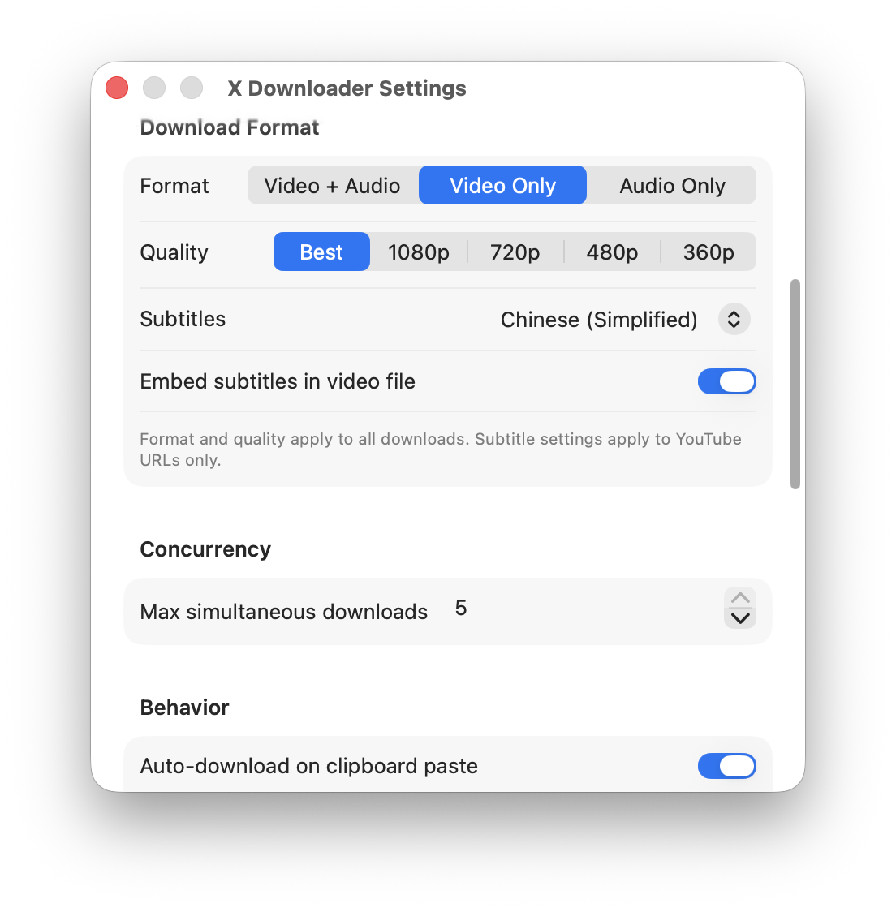
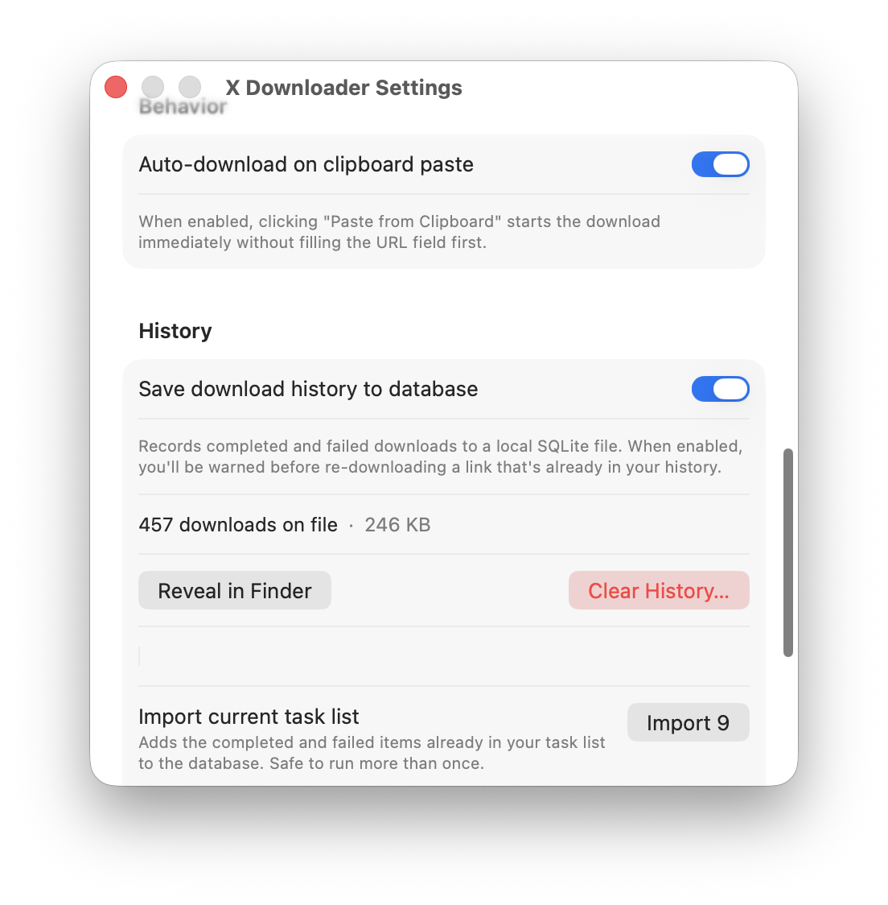

<div align="center">


# XDownloader

**Paste a link. Get the file. That's it.**

A native macOS app for downloading videos and images from X (Twitter), YouTube,
Instagram, and 1,000+ other sites — powered by `yt-dlp` and `gallery-dl`,
wrapped in a clean SwiftUI front end.

[](https://github.com/gin419/my-downloader/releases/latest)
[](#requirements)
[](Package.swift)
[](#license)

### [⬇ Download XDownloader](https://github.com/gin419/my-downloader/releases/latest) · [🛠 Build from source](#build-from-source) · [✨ Features](#features)

</div>

---

## Why XDownloader?

There are dozens of "paste a link, get a video" sites out there. They're slow,
covered in ads, capped at 720p, and they don't know about the tweet you can only
see because you're logged in. XDownloader runs locally, uses **your browser's
own session cookies**, and quietly gets out of the way.

|  |  |  |
| :---: | :---: | :---: |
| 🐦 **X / Twitter, even logged-in** | 📺 **YouTube with subtitles** | 🖼 **Multi-image tweets** |
| Uses your Safari / Chrome / Firefox cookies — protected and quote-tweet media just works. | Pick a language, embed into the file or save as a sidecar `.srt`. | Auto-falls back to `gallery-dl` and grabs every image in the thread. |
| ⚡ **5 parallel downloads** | 🧹 **Tracking params stripped** | 📋 **⌘D from anywhere** |
| Queue a whole tab of links and walk away. Cap is configurable. | `utm_*`, `?si=`, `fbclid`, `gclid` — gone before the URL ever hits the network. | Paste-and-download straight from the clipboard, no window switching. |

Other things you'll notice the first day:

- **Drag a URL onto the window** from any app — Safari tab, Notes, Messages — and the download starts.
- **Paste & Download** — the big blue button reads your clipboard and downloads every link on it; type in the field instead and the same button becomes plain **Download**.
- **Click the row title** to open the file. **Show in Finder** is always one click away. Failed download? **Retry** or **Copy Link** are right there.
- **Live progress** — real speed, real ETA, real file size. Status badges for *Queued / Fetching / Downloading / Done / Failed*.
- **Menu bar counter** — a status item counts active downloads and flags failures you haven't seen; its menu pastes, retries, and jumps back to the window.
- **Automation-ready** — `xdownloader://download?url=…` for Shortcuts/Raycast (queues quietly in the background), plus File → Import Links… (⌘O) for a text file full of URLs.
- **Cross-session memory** — your queue and download history survive an app restart (SQLite-backed, deduped across sessions).
- **Sync your X Likes** — enter one `@handle` and save every accessible liked image, video, and GIF. Later scans use a per-account archive to skip media already on disk, and failed links stay available for retry.

---

## Screenshots

<div align="center">



*Main window — filter tabs, live progress, status badges, click to open, Show in Finder.*

</div>

<table align="center">
<tr>
<td></td>
<td></td>
<td></td>
</tr>
<tr>
<td align="center"><em>Folder · Cookies · Format</em></td>
<td align="center"><em>Quality · Subtitles · Concurrency</em></td>
<td align="center"><em>Auto-paste · History</em></td>
</tr>
</table>

---

## Quick start

```bash
# 1. Install the three CLI tools XDownloader drives
brew install yt-dlp gallery-dl ffmpeg

# 2. Grab the latest release
#    → https://github.com/gin419/my-downloader/releases/latest
#    Unzip the downloaded XDownloader-*.zip and drag XDownloader.app to /Applications

# 3. Launch, paste a URL, press Enter.
```

> **First run:** XDownloader is signed with an Apple Developer ID and notarized
> by Apple, so it just opens — double-click `XDownloader.app` and you're set. No
> right-click → **Open** dance, no Gatekeeper warning.

### Requirements

| Tool | Why | Install |
| --- | --- | --- |
| macOS 14+ (Apple Silicon or Intel) | SwiftUI features used by the UI; the app ships as a universal binary | — |
| [`yt-dlp`](https://github.com/yt-dlp/yt-dlp) | Video downloads (X, YouTube, 1,000+ sites) | `brew install yt-dlp` |
| [`gallery-dl`](https://github.com/mikf/gallery-dl) | Image downloads (multi-image tweets) | `brew install gallery-dl` |
| [`ffmpeg`](https://ffmpeg.org) | Merges separate video + audio streams | `brew install ffmpeg` |

---

## Build from source

```bash
# Release .app bundle (default)
./build.sh

# Debug .app bundle
./build.sh debug

# Run directly via SPM — no bundle, useful for iterating
swift run
```

After `./build.sh`, drag the resulting `XDownloader.app` to `/Applications/`.

---

## Features

<details>
<summary><strong>Full feature list (click to expand)</strong></summary>

### URL input
- Paste or type any URL and press Enter
- **Paste & Download** button — one click from clipboard to download
- **Drag & drop** a URL from any app onto the window
- **`⌘D`** menu shortcut for "Paste and Download"
- Status-line feedback for every capture (queued / no link / already in your list)

### Download engine
- **X / Twitter Likes sync** — manually scan one account's Likes using the selected browser profile; results stay in one aggregate task instead of flooding the normal queue, and `cookies.txt` is only an optional fallback
- **X / Twitter videos** via `yt-dlp` + your browser cookies
- **X / Twitter images** via `gallery-dl` fallback (multi-image aware)
- **Instagram** — Reels, videos & video carousels via `yt-dlp`, image & mixed carousels via the `gallery-dl` fallback (sign in to Instagram in your cookie-source browser)
- **YouTube** and any other `yt-dlp`-supported site
- **Smart fallback** when `yt-dlp` follows an external link out of a tweet
- **Tracking parameter stripping** before download
- **Up to 5 concurrent downloads** (configurable)

### Formats
- **Video + Audio** — best-quality MP4, merged
- **Video Only** — best pre-muxed MP4 (no merge step)
- **Audio Only** — extracts MP3 at highest quality

### Subtitles (YouTube)
- Pick from English, Chinese (Trad/Simp), Japanese, Korean, Spanish, French
- Embed into the video, or save as sidecar `.srt`/`.vtt`

### Download list
- Live progress bar with speed, ETA, file size
- Status badges: *Queued / Fetching / Downloading / Done / Failed*
- Click row title to open the file
- **Show in Finder** on completion
- Image count per tweet
- **Retry** and **Copy Link** on failure
- **Remove** per row, **Clear Done** for all completed
- Animated row transitions

### Settings
- Download folder picker (defaults to `~/Downloads/X-Videos`)
- Cookie browser: Safari / Chrome / Firefox / Edge / None
- X account handle and browser-cookie verification for Likes sync
- Format, subtitle language, embed toggle
- Max concurrent downloads (1–5)
- Show download date & time per row
- "Open completed file as" Video / Audio preference

</details>

See [FEATURES.md](docs/FEATURES.md) for the canonical list.

---

## Roadmap

The end state: an app you could hand to someone who has never heard of
`yt-dlp` — one gesture in, file out, no Homebrew, no terminal.

Pillars 1 and 2 have shipped (notifications, batch input, menu bar,
`xdownloader://`, file import). Pillar 3 is almost there: auto-update,
signed/notarized universal releases, and in-app tool install/upgrade via
Homebrew. Still open: a Homebrew-free first launch, and the primed hero
button. Next is pillar 4 — a library, not a log.

See [ROADMAP.md](docs/ROADMAP.md) for the full plan — it's the source of truth.

---

## Project structure

```
Sources/XDownloader/
├── App/            Entry point (XDownloaderApp)
├── Models/         DownloadItem, enums (formats, languages, etc.)
├── Services/       ProcessRunner, YtDlpService, GalleryDlService
├── ViewModels/     DownloadManager (queue, settings, coordination)
└── Views/          ContentView, DownloadRowView, SettingsView
Resources/          Info.plist, AppIcon.icns
```

---

## License

[GNU AGPL-3.0](LICENSE) © 2025–2026 gin419.

XDownloader is **copyleft**: you're free to use, study, modify, and share it — but
any distributed or network-deployed derivative **must also be released as open
source under AGPL-3.0**. In other words, you may not repackage it into a
closed-source product. Selling it is allowed *only if* you also provide the
complete corresponding source under the same license.

XDownloader is a thin SwiftUI layer over the work of the
[`yt-dlp`](https://github.com/yt-dlp/yt-dlp) and
[`gallery-dl`](https://github.com/mikf/gallery-dl) teams — it would do nothing
without them. If this app saves you time, please sponsor them:

- **yt-dlp** — its maintainers each accept sponsorship via the
  [Maintainers list](https://github.com/yt-dlp/yt-dlp/blob/master/Maintainers.md#maintainers)
  (e.g. [coletdjnz](https://github.com/sponsors/coletdjnz),
  [Grub4K](https://github.com/sponsors/Grub4K)).
- **gallery-dl** — [Ko-fi](https://ko-fi.com/mikofaehrmann) or
  [PayPal](https://www.paypal.me/mikefaehrmann) (author
  [@mikf](https://github.com/mikf)).
