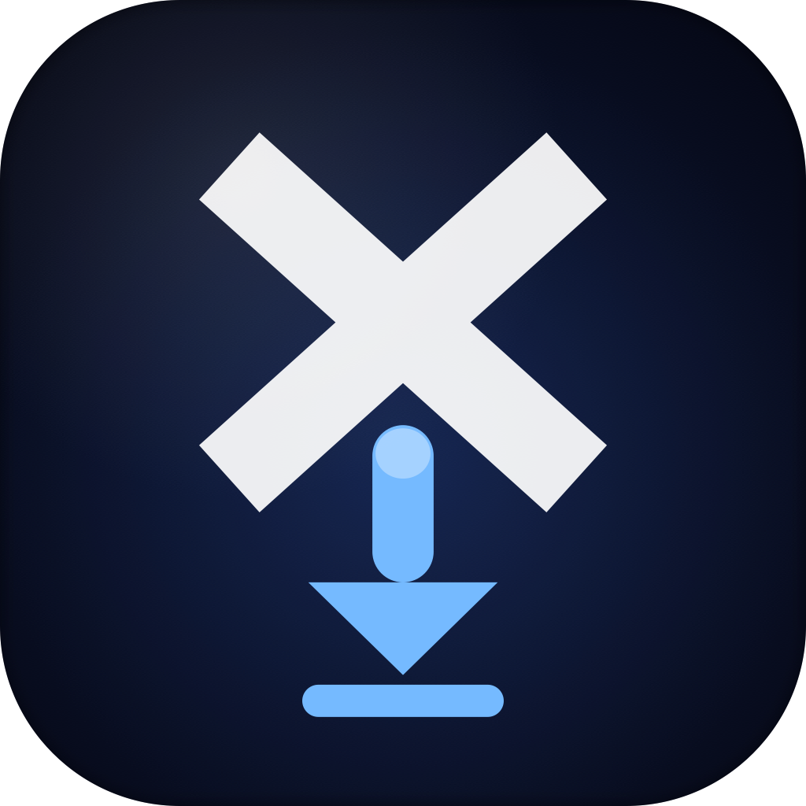

<div align="center">



# XDownloader

**Paste a link. Get the file. That's it.**

A native macOS app for downloading videos and images from X (Twitter), YouTube,
and 1,000+ other sites — powered by `yt-dlp` and `gallery-dl`, wrapped in a
clean SwiftUI front end.

[](https://github.com/gin419/my-downloader/releases/latest)
[](#requirements)
[](Package.swift)
[](#license)

### [⬇ Download XDownloader v1.3.0](https://github.com/gin419/my-downloader/releases/latest) · [🛠 Build from source](#build-from-source) · [✨ Features](#features)

</div>

---

## Why XDownloader?

There are dozens of "paste a link, get a video" sites out there. They're slow,
covered in ads, capped at 720p, and they don't know about the tweet you can only
see because you're logged in. XDownloader runs locally, uses **your browser's
own session cookies**, and quietly gets out of the way.

|  |  |  |
| :---: | :---: | :---: |
| 🐦 **X / Twitter, even logged-in** | 📺 **YouTube with subtitles** | 🖼 **Multi-image tweets** |
| Uses your Safari / Chrome / Firefox cookies — protected and quote-tweet media just works. | Pick a language, embed into the file or save as a sidecar `.srt`. | Auto-falls back to `gallery-dl` and grabs every image in the thread. |
| ⚡ **5 parallel downloads** | 🧹 **Tracking params stripped** | 📋 **⌘D from anywhere** |
| Queue a whole tab of links and walk away. Cap is configurable. | `utm_*`, `?si=`, `fbclid`, `gclid` — gone before the URL ever hits the network. | Paste-and-download straight from the clipboard, no window switching. |

Other things you'll notice the first day:

- **Drag a URL onto the window** from any app — Safari tab, Notes, Messages — and the download starts.
- **Auto-download on paste** — flip a switch in Settings and any URL on your clipboard is queued the moment you focus the app.
- **Click the row title** to open the file. **Show in Finder** is always one click away. Failed download? **Retry** or **Copy Link** are right there.
- **Live progress** — real speed, real ETA, real file size. Status badges for *Queued / Fetching / Downloading / Done / Failed*.
- **Cross-session memory** — your queue and download history survive an app restart (SQLite-backed, deduped across sessions).

---

## Screenshots

<div align="center">


*Main window — filter tabs, live progress, status badges, click to open, Show in Finder.*

</div>

<table align="center">
<tr>
<td></td>
<td></td>
<td></td>
</tr>
<tr>
<td align="center"><em>Folder · Cookies · Format</em></td>
<td align="center"><em>Quality · Subtitles · Concurrency</em></td>
<td align="center"><em>Auto-paste · History</em></td>
</tr>
</table>

---

## Quick start

```bash
# 1. Install the three CLI tools XDownloader drives
brew install yt-dlp gallery-dl ffmpeg

# 2. Grab the latest release
#    → https://github.com/gin419/my-downloader/releases/latest
#    Unzip XDownloader-v1.3.0.zip and drag XDownloader.app to /Applications

# 3. Launch, paste a URL, press Enter.
```

> **First run:** macOS Gatekeeper may ask you to confirm the app since it's
> unsigned. Right-click `XDownloader.app` → **Open** → **Open** once, and you're
> set for good.

### Requirements

| Tool | Why | Install |
| --- | --- | --- |
| macOS 14+ | SwiftUI features used by the UI | — |
| [`yt-dlp`](https://github.com/yt-dlp/yt-dlp) | Video downloads (X, YouTube, 1,000+ sites) | `brew install yt-dlp` |
| [`gallery-dl`](https://github.com/mikf/gallery-dl) | Image downloads (multi-image tweets) | `brew install gallery-dl` |
| [`ffmpeg`](https://ffmpeg.org) | Merges separate video + audio streams | `brew install ffmpeg` |

---

## Build from source

```bash
# Release .app bundle (default)
./build.sh

# Debug .app bundle
./build.sh debug

# Run directly via SPM — no bundle, useful for iterating
swift run
```

After `./build.sh`, drag the resulting `XDownloader.app` to `/Applications/`.

---

## Features

<details>
<summary><strong>Full feature list (click to expand)</strong></summary>

### URL input
- Paste or type any URL and press Enter
- **Paste from Clipboard** button — one click
- **Drag & drop** a URL from any app onto the window
- **`⌘D`** menu shortcut for "Paste and Download"
- Optional **auto-download on paste**

### Download engine
- **X / Twitter videos** via `yt-dlp` + your browser cookies
- **X / Twitter images** via `gallery-dl` fallback (multi-image aware)
- **YouTube** and any other `yt-dlp`-supported site
- **Smart fallback** when `yt-dlp` follows an external link out of a tweet
- **Tracking parameter stripping** before download
- **Up to 5 concurrent downloads** (configurable)

### Formats
- **Video + Audio** — best-quality MP4, merged
- **Video Only** — best pre-muxed MP4 (no merge step)
- **Audio Only** — extracts MP3 at highest quality

### Subtitles (YouTube)
- Pick from English, Chinese (Trad/Simp), Japanese, Korean, Spanish, French
- Embed into the video, or save as sidecar `.srt`/`.vtt`

### Download list
- Live progress bar with speed, ETA, file size
- Status badges: *Queued / Fetching / Downloading / Done / Failed*
- Click row title to open the file
- **Show in Finder** on completion
- Image count per tweet
- **Retry** and **Copy Link** on failure
- **Remove** per row, **Clear Done** for all completed
- Animated row transitions

### Settings
- Download folder picker (defaults to `~/Downloads/X-Videos`)
- Cookie browser: Safari / Chrome / Firefox / Edge / None
- Format, subtitle language, embed toggle
- Max concurrent downloads (1–5)
- Auto-download on paste toggle
- Show download date & time per row
- "Open completed file as" Video / Audio preference

</details>

See [FEATURES.md](FEATURES.md) for the canonical list.

---

## Roadmap

<details>
<summary><strong>What's next</strong></summary>

### Near-term
- macOS notification when a download completes
- Pause / cancel an in-progress download
- Batch input — paste many URLs at once
- Menu bar icon with live download count

### Future
- In-app preview (thumbnail or inline player)
- Per-download format override
- Share Sheet / browser extension
- Import from a text file of URLs

</details>

See [ROADMAP.md](ROADMAP.md) for the source of truth.

---

## Project structure

```
Sources/XDownloader/
├── App/            Entry point (XDownloaderApp)
├── Models/         DownloadItem, enums (formats, languages, etc.)
├── Services/       ProcessRunner, YtDlpService, GalleryDlService
├── ViewModels/     DownloadManager (queue, settings, coordination)
└── Views/          ContentView, DownloadRowView, SettingsView
Resources/          Info.plist, AppIcon.icns
```

---

## License

MIT. Do whatever you want — credit appreciated, not required.

XDownloader is a thin SwiftUI layer over the work of the
[`yt-dlp`](https://github.com/yt-dlp/yt-dlp) and
[`gallery-dl`](https://github.com/mikf/gallery-dl) teams. Please consider
sponsoring them if this app saves you time.
